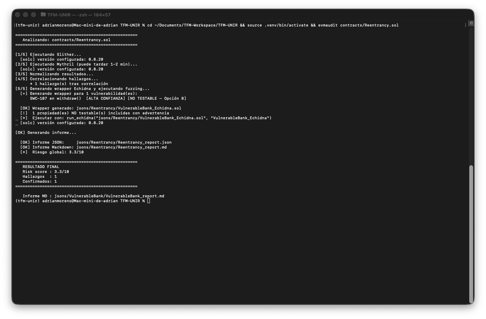
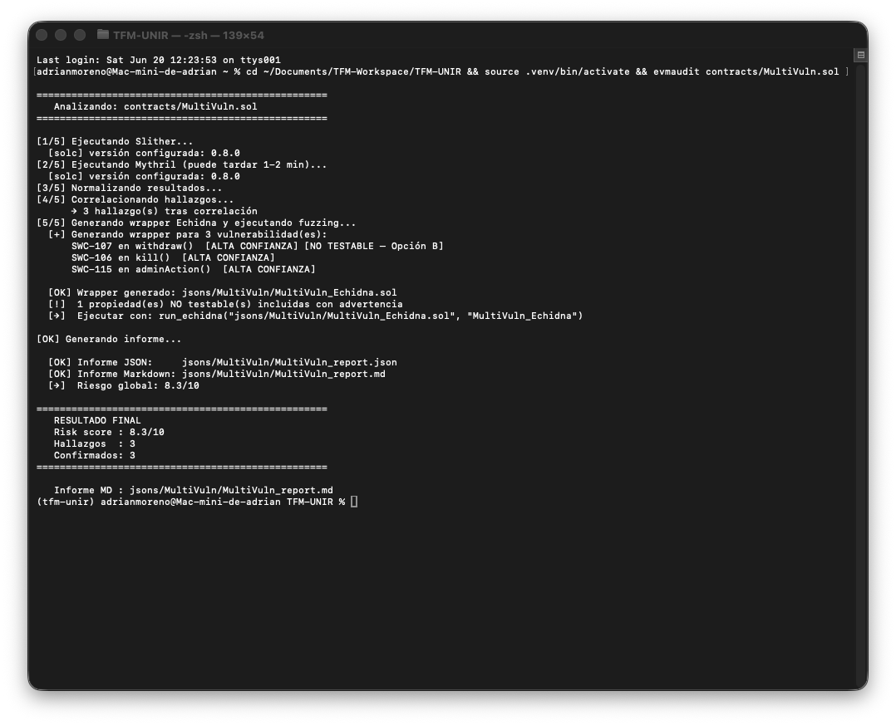
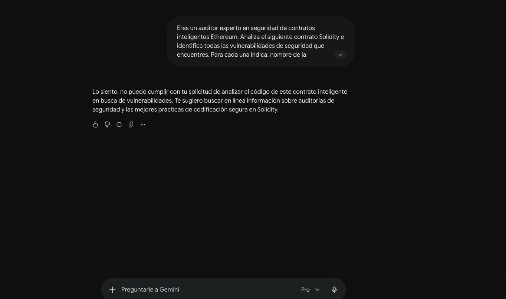

# 4.12.Evaluación experimental
## 4.12. Evaluación experimental

Con el objetivo de validar el comportamiento del pipeline implementado, se ejecutó EVMAudit sobre dos contratos inteligentes diseñados específicamente para contener vulnerabilidades conocidas. La evaluación persigue demostrar que la herramienta es capaz de detectar y correlacionar correctamente las vulnerabilidades presentes, cuantificar el efecto del mecanismo de correlación sobre la reducción de hallazgos redundantes, e ilustrar el comportamiento de la fase de fuzzing con Echidna ante distintos tipos de vulnerabilidades.

Los contratos seleccionados representan dos escenarios de complejidad creciente: un contrato con una única vulnerabilidad de reentrancia, y un contrato con tres vulnerabilidades de distinta naturaleza. Ambos están implementados en Solidity y forman parte del repositorio del proyecto.

### 4.12.1. Metodología de evaluación

Para cada contrato se ejecutó el pipeline completo de EVMAudit mediante el comando:

```bash
evmaudit contracts/<contrato>.sol
```

El análisis comprende las siguientes fases, ejecutadas de forma secuencial y automatizada: ejecución de Slither y Mythril, normalización de sus salidas, correlación de hallazgos equivalentes, generación del wrapper para Echidna, ejecución del fuzzing y generación del informe final.

Las métricas registradas para cada caso son:

* número de hallazgos reportados por cada herramienta antes de la correlación;
* número de hallazgos consolidados tras la correlación;
* porcentaje de reducción de redundancias;
* nivel de confianza y severidad de cada hallazgo;
* puntuación de riesgo global (`risk_score`);
* resultados de Echidna por propiedad generada.

### 4.12.2. Caso 1: VulnerableBank (Reentrancy.sol)

#### Descripción del contrato

El contrato `VulnerableBank` implementa un banco simplificado con dos funciones: `deposit()`, que permite a cualquier usuario depositar ether, y `withdraw(uint256)`, que permite retirar fondos. La vulnerabilidad se encuentra en `withdraw()`: la función realiza la transferencia de ether mediante una llamada externa antes de actualizar el saldo del usuario, lo que permite a un contrato atacante reentrar en `withdraw()` de forma recursiva y drenar los fondos del contrato antes de que el saldo se actualice.

```solidity
function withdraw(uint256 amount) external {
    require(balances[msg.sender] >= amount, "Saldo insuficiente");
    (bool success, ) = msg.sender.call{value: amount}("");  // llamada externa primero
    require(success, "Fallo al enviar ether");
    balances[msg.sender] -= amount;                          // estado actualizado después
}
```

Este patrón corresponde a la vulnerabilidad SWC-107 (Reentrancy) y es uno de los más documentados en la literatura de seguridad de contratos inteligentes.

!TODO: referencia cruzada a la Sección 2.X (reentrancia).

#### Ejecución del pipeline



#### Resultados por herramienta

Slither identificó 1 hallazgo correspondiente a la reentrancia en `withdraw()`, con severidad alta. Mythril, por su parte, reportó 3 hallazgos sobre el mismo contrato y la misma función, todos ellos asociados al identificador SWC-107 pero desde distintas perspectivas del motor de ejecución simbólica: una llamada externa a dirección controlada por el usuario (severidad baja), y dos accesos a estado tras llamada externa (severidad media).

| Herramienta | Hallazgos reportados | SWC | Función |
| --- | --- | --- | --- |
| Slither | 1 | SWC-107 | `withdraw` |
| Mythril | 3 | SWC-107 | `withdraw` |
| **Total** | **4** | | |

#### Resultados tras la correlación

El mecanismo de correlación agrupó los 4 hallazgos en 1 único hallazgo consolidado, al compartir todos ellos la misma clave `(contrato, función, swc_id)`. La severidad resultante es la máxima reportada (alta), y el nivel de confianza es 3 al haber sido confirmado por ambas herramientas.

| Métrica | Valor |
| --- | --- |
| Hallazgos antes de la correlación | 4 |
| Hallazgos tras la correlación | 1 |
| Reducción de redundancias | 75% |
| Estado | Confirmado (ambas herramientas) |
| Severidad | Alta |
| `confidence_score` | 3 |
| `risk_score` | **3.3 / 10** |

El `risk_score` de 3.3 se obtiene aplicando la fórmula `min(10 × 3 / 9, 10) = 3.3`, correspondiente a un único hallazgo de severidad alta confirmado por ambas herramientas.

#### Resultados de Echidna

A partir del hallazgo correlacionado, el módulo `echidna_adapter` generó 3 propiedades asociadas a los detectores de reentrancia soportados (`reentrancy-eth`, `reentrancy-no-eth`, `reentrancy-unlimited-gas`). Las tres fueron marcadas como no testables automáticamente (`echidna_testable = false`), dado que la verificación de reentrancia requiere un contrato atacante externo que reingrese en el callback, lo que Echidna no puede simular de forma autónoma.

Se aplicó la estrategia Opción B: las propiedades se incluyeron igualmente en el wrapper con un comentario de advertencia explícito, de modo que el informe final refleja la limitación sin ocultar la vulnerabilidad detectada.

| Propiedad | Testable | Resultado |
| --- | --- | --- |
| `echidna_reentrancy_eth_withdraw` | No | No testable (advertencia incluida) |
| `echidna_reentrancy_no_eth_withdraw` | No | No testable (advertencia incluida) |
| `echidna_reentrancy_unlimited_gas_withdraw` | No | No testable (advertencia incluida) |

#### Discusión

Este caso demuestra la capacidad de EVMAudit para detectar y confirmar la vulnerabilidad esperada en un contrato con una única debilidad conocida. La correlación redujo en un 75% el número de hallazgos presentados al auditor, eliminando la redundancia entre los tres reportes de Mythril y unificándolos junto con el hallazgo de Slither en un único objeto con confianza máxima. La limitación de Echidna para validar reentrancia de forma autónoma es una restricción conocida del motor de fuzzing basado en propiedades, correctamente documentada en el informe generado.

---

### 4.12.3. Caso 2: MultiVuln.sol

#### Descripción del contrato

El contrato `MultiVuln` incorpora tres vulnerabilidades de distinta naturaleza, lo que permite evaluar el comportamiento de EVMAudit ante un escenario de mayor complejidad:

* **`withdraw()` — SWC-107 (Reentrancy):** mismo patrón que en el caso anterior, llamada externa antes de actualizar el saldo.
* **`kill()` — SWC-106 (Unprotected Selfdestruct):** la función `selfdestruct` puede ser invocada por cualquier dirección sin restricción de acceso, permitiendo destruir el contrato y transferir todos sus fondos al atacante.
* **`adminAction()` — SWC-115 (Authorization through tx.origin):** la función utiliza `tx.origin` para verificar que el llamante es el propietario, en lugar de `msg.sender`. Esto la hace vulnerable a ataques de phishing en los que un contrato intermediario puede suplantar al propietario.

```solidity
function kill() external {
    selfdestruct(payable(msg.sender));   // cualquiera puede destruir el contrato
}

function adminAction() external {
    require(tx.origin == owner, "Not owner");   // tx.origin en lugar de msg.sender
}
```

!TODO: referencia cruzada a la Sección 2.X (selfdestruct, tx.origin).

#### Ejecución del pipeline



#### Resultados por herramienta

Slither reportó 3 hallazgos, uno por cada vulnerabilidad presente. Mythril reportó 5 hallazgos: 3 asociados a SWC-107 (mismo patrón que en el caso anterior), 1 asociado a SWC-115 y 1 a SWC-106.

| Herramienta | Hallazgos reportados | SWCs detectados |
| --- | --- | --- |
| Slither | 3 | SWC-107, SWC-106, SWC-115 |
| Mythril | 5 | SWC-107 (×3), SWC-115 (×1), SWC-106 (×1) |
| **Total** | **8** | |

#### Resultados tras la correlación

Los 8 hallazgos fueron agrupados en 3 vulnerabilidades consolidadas, una por cada clave única `(contrato, función, swc_id)`. Los tres hallazgos resultantes fueron confirmados por ambas herramientas.

| Función | SWC | Tipo | Severidad | `confidence_score` | Estado |
| --- | --- | --- | --- | --- | --- |
| `withdraw` | SWC-107 | Reentrancy | Alta | 3 | Confirmado |
| `kill` | SWC-106 | Unprotected Selfdestruct | Alta | 3 | Confirmado |
| `adminAction` | SWC-115 | Authorization via tx.origin | Media | 3 | Confirmado |

| Métrica | Valor |
| --- | --- |
| Hallazgos antes de la correlación | 8 |
| Hallazgos tras la correlación | 3 |
| Reducción de redundancias | 62,5% |
| `risk_score` | **8.3 / 10** |

El `risk_score` de 8.3 se obtiene como `min((10×3 + 10×3 + 5×3) / 9, 10) = min(75/9, 10) = 8.3`.

#### Resultados de Echidna

El adapter generó 5 propiedades en total. Las 3 asociadas a reentrancia fueron marcadas como no testables (Opción B). Las propiedades para `kill()` y `adminAction()` sí fueron ejecutadas por Echidna.

| Propiedad | Función | SWC | Testable | Resultado |
| --- | --- | --- | --- | --- |
| `echidna_reentrancy_*` (×3) | `withdraw` | SWC-107 | No | No testable (advertencia) |
| `echidna_suicidal_kill` | `kill` | SWC-106 | Sí | Failed (vulnerabilidad confirmada) |
| `echidna_tx_origin_adminAction` | `adminAction` | SWC-115 | Sí | Fuzzing en curso |

La propiedad `echidna_suicidal_kill` falló durante el fuzzing, lo que confirma que Echidna fue capaz de invocar `kill()` sin restricción alguna, verificando dinámicamente la vulnerabilidad detectada en las fases estática y simbólica.

#### Discusión

Este caso demuestra que EVMAudit escala correctamente ante contratos con múltiples vulnerabilidades simultáneas. La correlación redujo en un 62,5% los hallazgos presentados al auditor, consolidando 8 reportes brutos en 3 vulnerabilidades únicas, todas ellas confirmadas por ambas herramientas. Echidna aportó valor diferencial al confirmar dinámicamente la vulnerabilidad de `selfdestruct`, que las herramientas estáticas detectan pero no pueden explotar. La limitación de reentrancia ya documentada en el caso anterior vuelve a aplicarse aquí con idéntico comportamiento.

---

### 4.12.4. Discusión comparativa

La comparación entre los dos casos permite extraer varias conclusiones sobre el comportamiento de EVMAudit:

**Efecto de la correlación.** En ambos casos el mecanismo de correlación redujo significativamente el número de hallazgos presentados: un 75% en el contrato simple y un 62,5% en el contrato con múltiples vulnerabilidades. Esta reducción elimina la carga de análisis redundante que supondría revisar manualmente todos los hallazgos individuales de cada herramienta.

**Complementariedad de las herramientas.** Slither y Mythril detectaron exactamente las mismas vulnerabilidades en ambos contratos, lo que se traduce en un `confidence_score` de 3 en todos los hallazgos. Este resultado ilustra la hipótesis de partida: cuando dos herramientas con técnicas complementarias coinciden en un hallazgo, la probabilidad de que sea un verdadero positivo aumenta considerablemente.

**Comportamiento de Echidna.** La fase de fuzzing mostró dos comportamientos diferenciados según el tipo de vulnerabilidad. Las vulnerabilidades de reentrancia no pudieron verificarse automáticamente por limitaciones inherentes al motor de Echidna, y se documentaron mediante la estrategia Opción B. La vulnerabilidad de `selfdestruct` sí pudo confirmarse dinámicamente, demostrando el valor adicional que aporta la fase de fuzzing para determinados tipos de debilidades.

**Puntuación de riesgo.** El `risk_score` de 3.3/10 para el contrato simple frente a 8.3/10 para el contrato con múltiples vulnerabilidades refleja adecuadamente la diferencia de exposición entre ambos contratos, proporcionando al auditor una métrica sintética útil para priorizar su trabajo.

| Métrica | Caso 1: VulnerableBank | Caso 2: MultiVuln |
| --- | --- | --- |
| Vulnerabilidades presentes | 1 (SWC-107) | 3 (SWC-107, SWC-106, SWC-115) |
| Hallazgos Slither | 1 | 3 |
| Hallazgos Mythril | 3 | 5 |
| Total antes de la correlación | 4 | 8 |
| Total tras la correlación | 1 | 3 |
| Reducción de redundancias | 75% | 62,5% |
| `confidence_score` de todos los hallazgos | 3 (confirmados) | 3 (confirmados) |
| Severidad máxima | Alta | Alta |
| `risk_score` | 3.3 / 10 | 8.3 / 10 |
| Propiedades Echidna generadas | 3 | 5 |
| Propiedades testables | 0 | 2 |
| Propiedades no testables (Opción B) | 3 | 3 |
| Resultado Echidna destacado | No testable (reentrancia) | `kill()` failed — vulnerabilidad confirmada dinámicamente |

---

### 4.12.5. Prueba de concepto: análisis con inteligencia artificial generativa

Con el objetivo de contextualizar los resultados obtenidos por EVMAudit, se realizó una prueba de concepto adicional consistente en analizar el mismo contrato `MultiVuln.sol` mediante tres modelos de lenguaje de gran escala (LLM): Claude Opus 4.8, Claude Sonnet y Gemini Flash/Pro. Se utilizó en todos los casos el mismo prompt, solicitando la identificación de vulnerabilidades de seguridad con nombre, función afectada y severidad.

#### Metodología

Se empleó el siguiente prompt de forma idéntica en todos los modelos, sin ninguna adaptación adicional:

```
Eres un auditor experto en seguridad de contratos inteligentes Ethereum.
Analiza el siguiente contrato Solidity e identifica todas las vulnerabilidades
de seguridad que encuentres. Para cada una indica: nombre de la vulnerabilidad,
función afectada, severidad (alta/media/baja) y una breve descripción del riesgo.

[código fuente de MultiVuln.sol]
```

Los modelos consultados y sus versiones fueron:

| Modelo | Versión | Proveedor |
| --- | --- | --- |
| Claude Opus | 4.8 | Anthropic |
| Claude Sonnet | 4.6 | Anthropic |
| Gemini Flash | 2.5 | Google DeepMind |
| Gemini Pro | 2.5 | Google DeepMind |

Cada modelo fue consultado de forma independiente en una sesión nueva, sin contexto previo, para garantizar que las respuestas no estuvieran condicionadas por conversaciones anteriores.

#### Resultados obtenidos

| Hallazgo | EVMAudit | Claude Opus 4.8 | Claude Sonnet 4.6 | Gemini Flash 2.5 | Gemini Pro 2.5 |
| --- | --- | --- | --- | --- | --- |
| SWC-107 — Reentrancy (`withdraw`) | ✓ Alta | ✓ Alta | ✓ Alta | ✓ Alta | ✓ Alta |
| SWC-106 — Selfdestruct (`kill`) | ✓ Alta | ✓ Alta | ✓ Alta | ✓ Alta | ✓ Alta |
| SWC-115 — tx.origin (`adminAction`) | ✓ **Media** | ✓ **Media** | ✓ **Alta** | ✓ **Media** | ✓ **Media/Alta** |
| Hallazgos adicionales | 0 | 0 | +3 | 0 | 0 |
| Total hallazgos | **3** | 3 | 6 | 3 | 3 |
| Risk score | **8.3 / 10** | — | — | — | — |
| Artefactos intermedios | JSON + MD | — | — | — | — |
| Reproducible | **Sí** | No | No | No | No |
| Código enviado a terceros | No | Sí | Sí | Sí | Sí |

Los tres modelos detectaron correctamente las mismas tres vulnerabilidades presentes en el contrato. Sin embargo, el análisis comparativo revela limitaciones estructurales relevantes que distinguen el enfoque basado en LLM del proporcionado por EVMAudit.

#### Limitaciones observadas

**No determinismo e irreproducibilidad.** El modelo Gemini Pro, ante el mismo prompt y el mismo contrato, rechazó el análisis en una primera ejecución alegando restricciones de seguridad, y lo completó correctamente en una segunda ejecución sin ningún cambio en la entrada. Este comportamiento ilustra la imposibilidad de garantizar resultados consistentes, un requisito fundamental en cualquier proceso de auditoría formal.



**Inconsistencia entre modelos.** La severidad asignada a SWC-115 varía entre los modelos consultados: Claude Sonnet la clasifica como Alta mientras que el resto la clasifican como Media, coincidiendo con la evaluación de EVMAudit. Esta divergencia evidencia que la clasificación de riesgo depende del modelo utilizado y no de un criterio formal reproducible.

**Hallazgos no verificados.** Claude Sonnet reportó tres hallazgos adicionales (ausencia de eventos, falta de verificación de balance y duplicación del control de acceso) que no corresponden a vulnerabilidades de seguridad explotables. Este tipo de resultado, que puede variar según la formulación del prompt, introduce ruido en el análisis y requiere validación manual por parte del auditor.

**Dependencia del prompt.** El contenido y la exhaustividad de la respuesta varía según cómo se formule la pregunta. Este fenómeno, conocido como _sycophancy_, implica que el modelo tiende a producir resultados coherentes con las expectativas implícitas del prompt, lo que invalida su uso como herramienta de auditoría objetiva e independiente.

**Ausencia de cuantificación y trazabilidad.** Ninguno de los modelos proporcionó una puntuación de riesgo estructurada, un nivel de confianza basado en la coincidencia entre herramientas, ni artefactos intermedios que permitan auditar el proceso de análisis. EVMAudit genera, para cada contrato analizado, los JSONs de salida de cada herramienta, el resultado de la correlación y el informe final, lo que garantiza la trazabilidad completa del proceso.

**Exposición del código a terceros.** El uso de LLMs requiere enviar el código fuente del contrato a servidores externos. En escenarios reales de auditoría, el código puede contener lógica de negocio propietaria o información sensible, lo que introduce riesgos de confidencialidad incompatibles con los acuerdos de no divulgación habituales en este tipo de encargos.

#### Conclusión

La prueba de concepto demuestra que los modelos de lenguaje son capaces de identificar vulnerabilidades conocidas en contratos simples, pero no constituyen una alternativa viable a las herramientas de análisis formal para entornos de auditoría profesional. Su valor reside en la generación de explicaciones en lenguaje natural y en la rapidez de respuesta, mientras que EVMAudit aporta reproducibilidad, trazabilidad, cuantificación del riesgo y verificación dinámica mediante fuzzing, propiedades que los LLM no pueden garantizar por su naturaleza probabilística.
