# 1. Diagrama de componentes UML — Arquitectura general

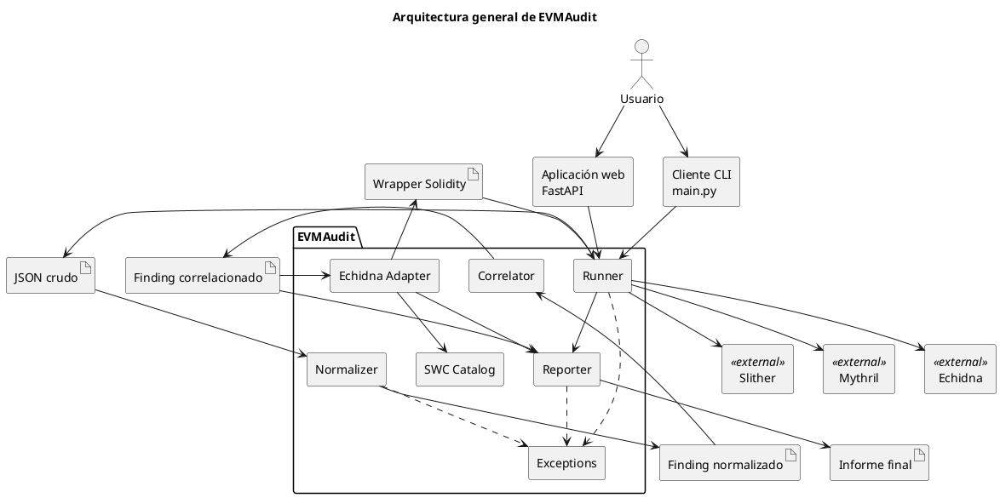

---

# 2. Diagrama de actividad UML — Pipeline completo

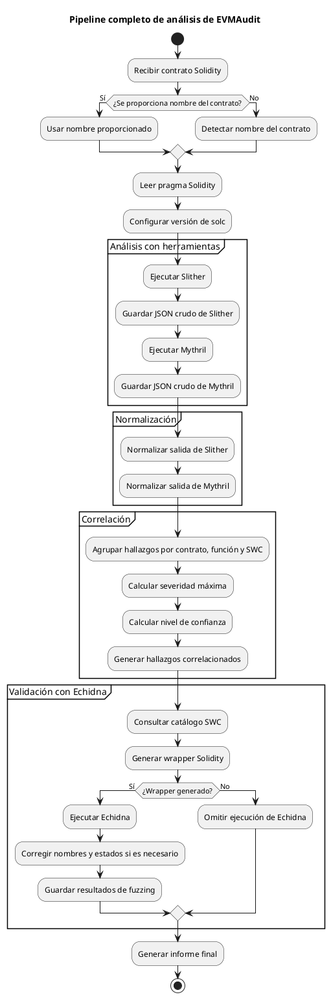

---

# 3. Diagrama de paquetes UML — Estructura modular

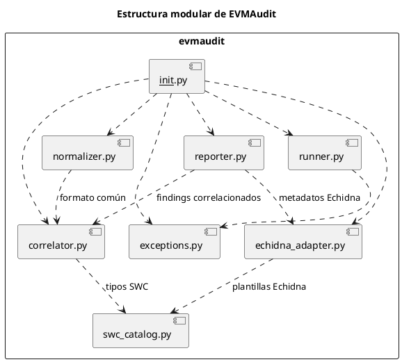

---

# 4. Diagrama de clases UML — Modelo de datos

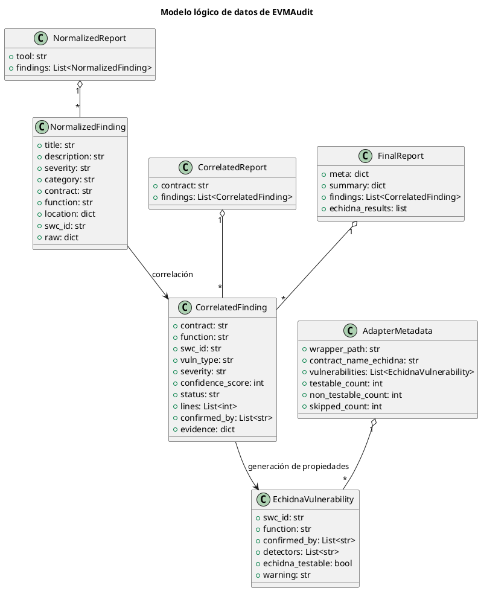

---

# 5. Diagrama de actividad UML — Correlación

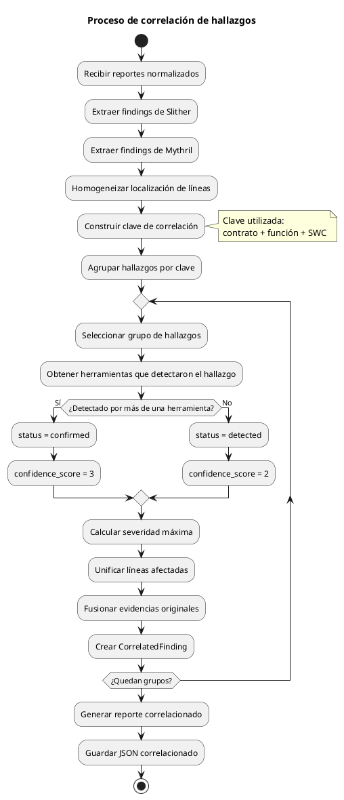

---

# 6. Diagrama de secuencia UML — Ejecución completa

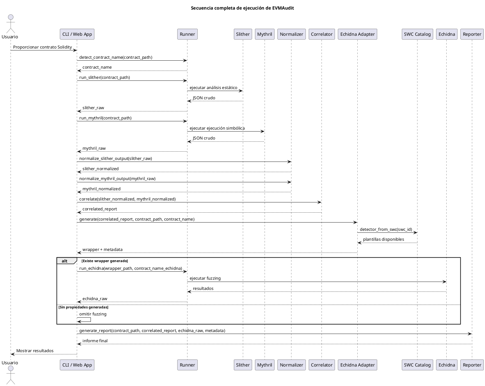

---

# 7. Diagrama de actividad UML — Generación de wrapper Echidna

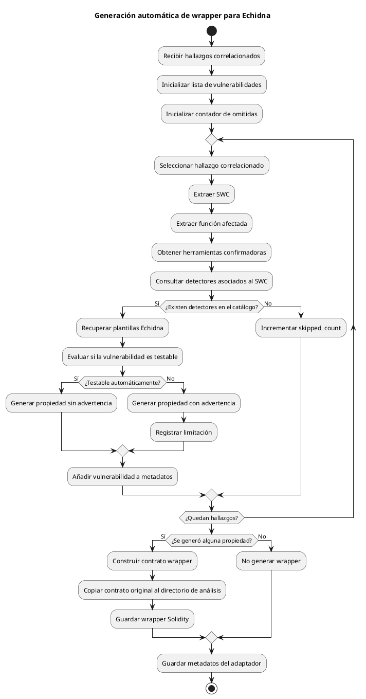

---

# 8. Diagrama de componentes UML — SWC Catalog y Echidna Adapter

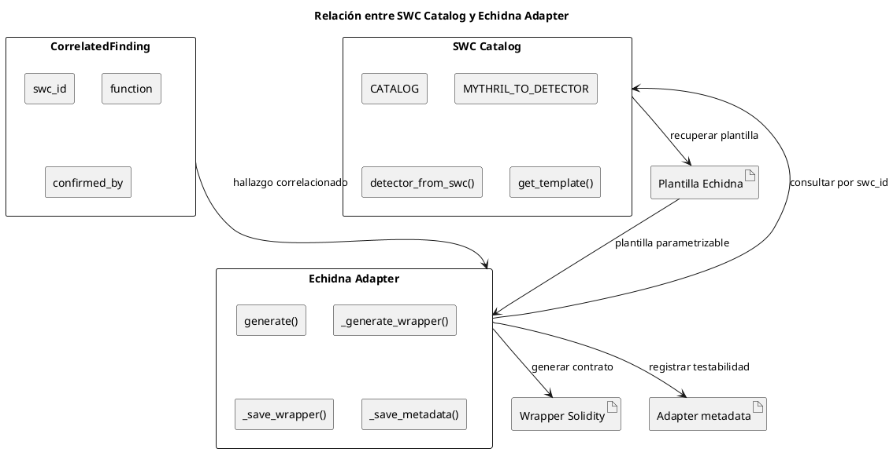

---

# 9. Diagrama de clases UML — Gestión de errores

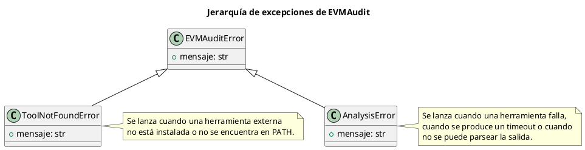

---

# 10. Diagrama de componentes UML — Aplicación web como caso de uso

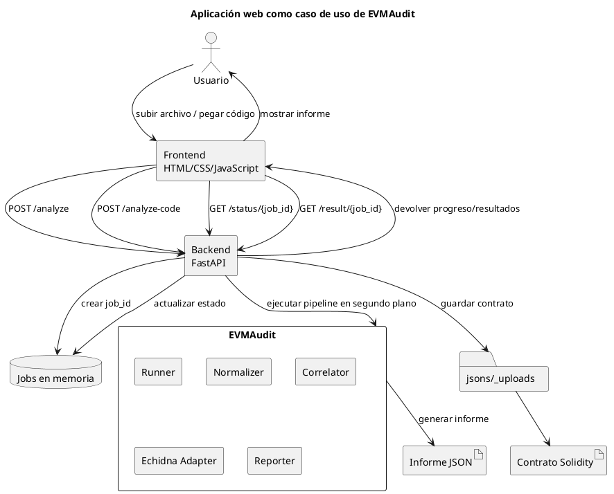

---

# 11. Diagrama de despliegue UML — Aplicación web

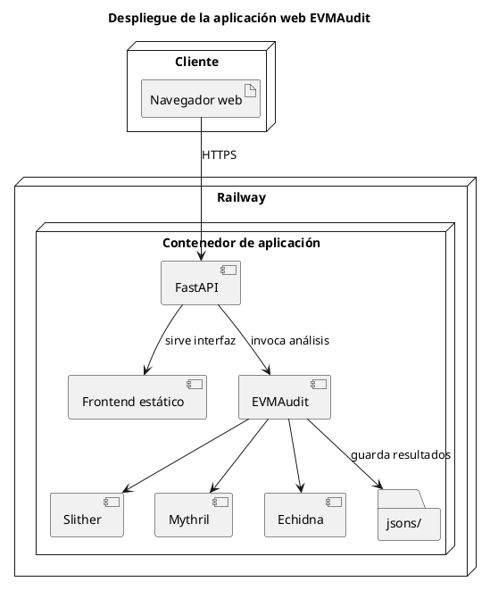
