Aquí tienes los diagramas en **PlantUML** listos para pegar.

## 1. Arquitectura general

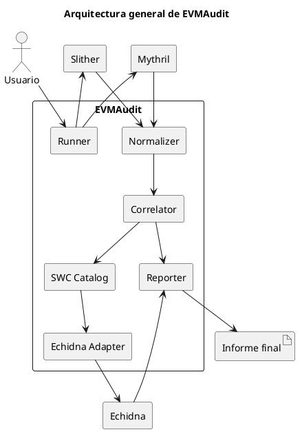

## 2. Pipeline de análisis

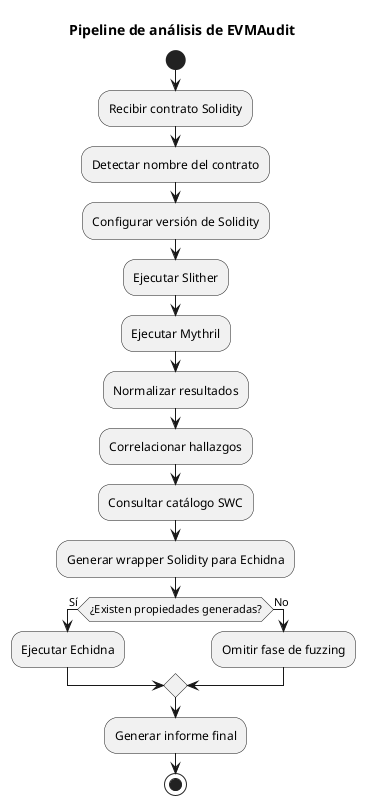

## 3. Diagrama de paquetes

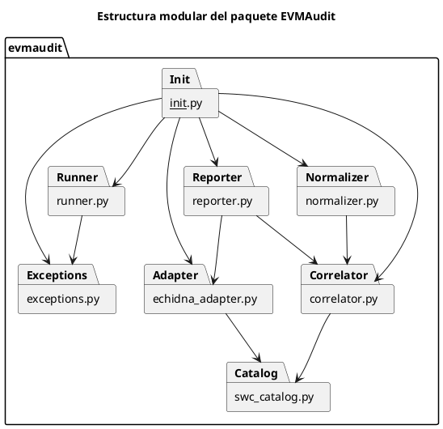

## 4. Modelo de hallazgo normalizado

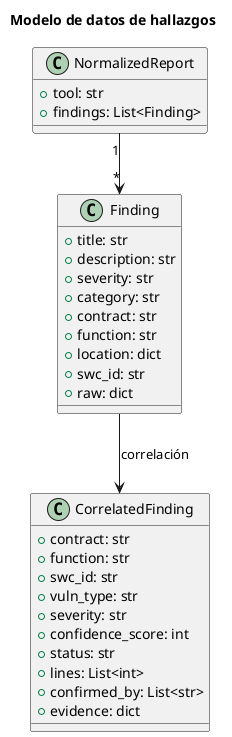

## 5. Proceso de correlación

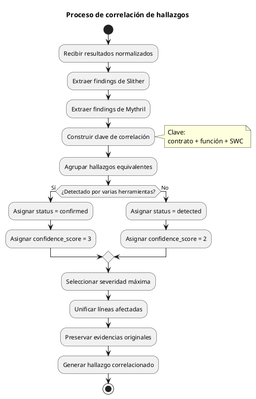

## 6. Secuencia completa

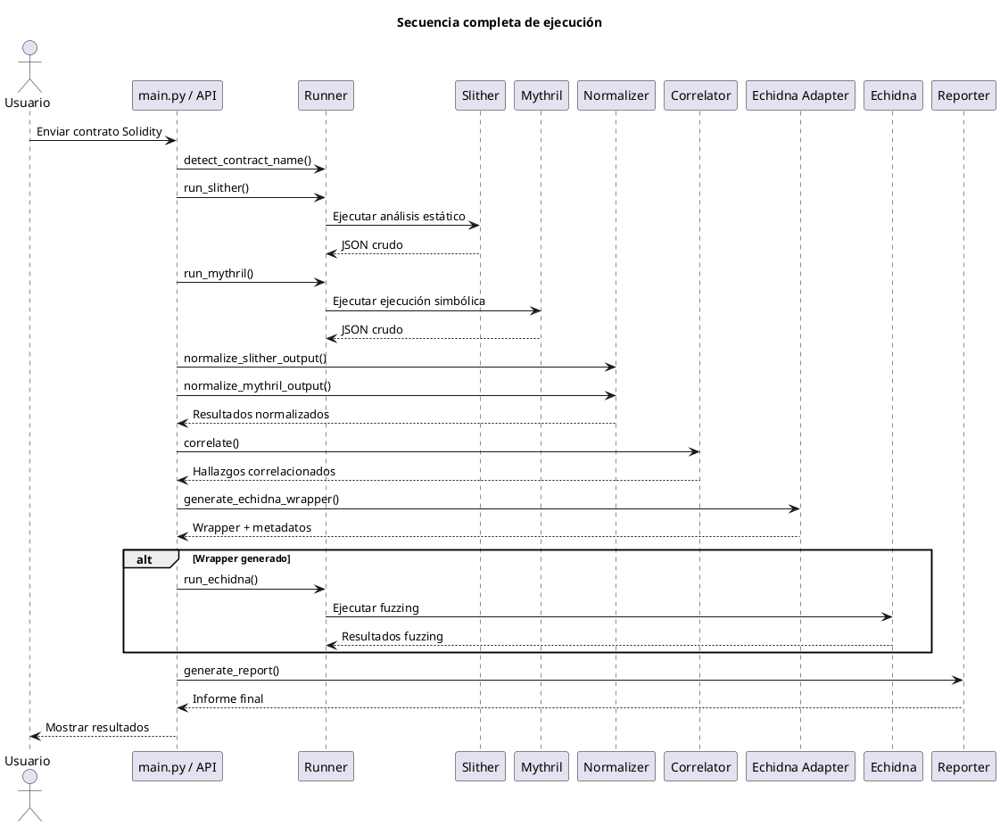

## 7. Generación de wrapper Echidna

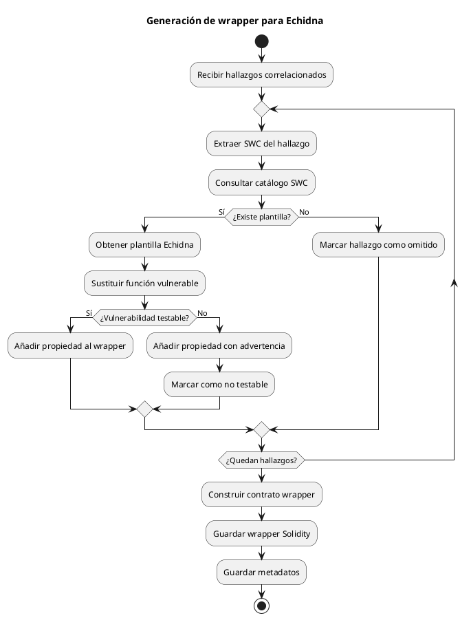

## 8. Relación SWC Catalog y Echidna Adapter

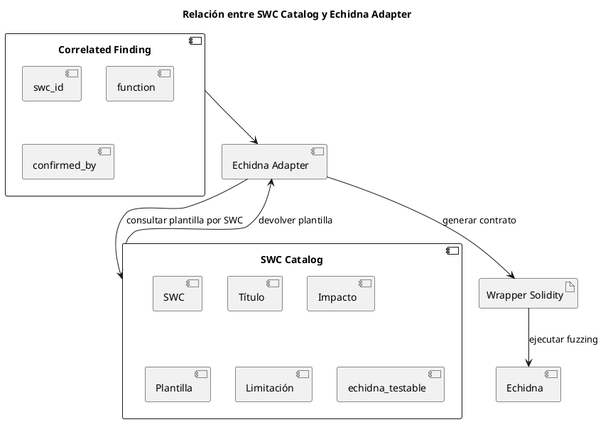

## 9. Gestión de errores

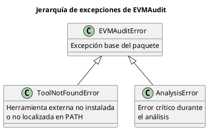

## 10. Aplicación web como caso de uso

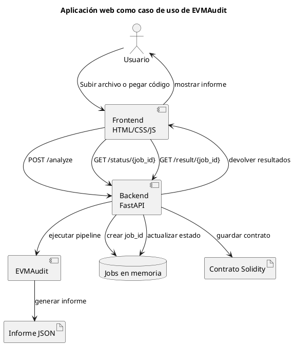

## 11. Despliegue web

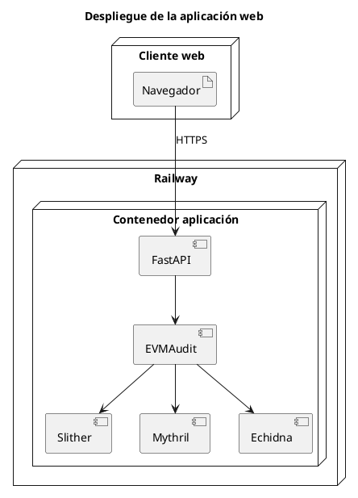
